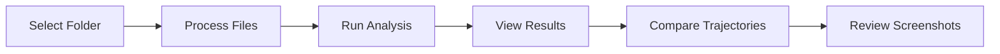

<div align="center">

# 

### 🔍 **Pure Client-Side Task Validation & Review System**

*A browser-based validation tool for OSWorld SFT trajectories - no backend required*

[](https://developer.mozilla.org/en-US/docs/Web/JavaScript)
[](https://developer.mozilla.org/en-US/docs/Web/HTML)
[](https://developer.mozilla.org/en-US/docs/Web/CSS)
[](LICENSE)

[Features](#-features) • [Quick Start](#-quick-start) • [Usage](#-usage) • [Validation Criteria](#-validation-criteria) • [Deployment](#-deployment)

</div>

---

## ✨ Features

### 🔐 **Privacy-First Architecture**
- **100% Client-Side Processing** - All validation happens in your browser
- **Zero Data Transmission** - No files are sent to any server
- **Local File Processing** - Complete privacy and security

### 📊 **Comprehensive Validation**
- **11 Validation Criteria** - Automated checks for task folder integrity
- **Step Count Analysis** - Compare SFT steps against positive runs
- **Score Verification** - Validate evaluation scores across trajectories
- **Duplicate Detection** - Identify copied or similar trajectories

### 🔬 **Advanced Comparison Tools**
- **Notebook Comparison** - Side-by-side comparison of assistant cells
- **Trajectory Analysis** - Visual similarity matrix and action sequence comparison
- **Interactive Screenshot Viewer** - Zoom, pan, and overlay action indicators
- **Action Overlay System** - Visualize clicks, drags, scrolls, and more

### 🎨 **Modern User Interface**
- **Matrix-Inspired Design** - Cyberpunk aesthetic with neon green accents
- **Interactive Screenshots** - Zoom up to 400% with coordinate-preserved overlays
- **Drag & Drop Support** - Intuitive folder selection
- **Real-Time Validation** - Instant feedback on task folder structure

---

## 🚀 Quick Start

### Option 1: Direct Browser Access
1. Open `index.html` in any modern web browser
2. Select your task folder
3. Click **Analyze** to run validation

### Option 2: GitHub Pages Deployment
```bash
# Clone the repository
git clone <repository-url>
cd OSWorld-SFT/WebSypher

# Deploy to GitHub Pages
# 1. Push to GitHub
# 2. Go to Settings > Pages
# 3. Select branch and /WebSypher directory
# 4. Access via: https://<username>.github.io/<repo>/WebSypher/
```

---

## 📖 Usage

### Folder Selection

WebSypher supports multiple folder selection methods:

| Method | Description |
|--------|-------------|
| **Browse Button** | Click "Browse" and select folder via file picker |
| **Drag & Drop** | Drag folder directly onto the drop zone |
| **File Selection** | Select all files if folder picker isn't supported |

### Validation Workflow



1. **Select Task Folder** - Choose a folder containing SFT and annotator trajectories
2. **Automatic Processing** - WebSypher builds an internal file tree
3. **Run Analysis** - Click "Analyze" to execute all 11 validation criteria
4. **Review Results** - Check pass/fail status for each criterion
5. **Deep Dive** - Use comparison views for detailed analysis

### Screenshot Viewer Features

- **🔍 Zoom Controls** - Zoom from 25% to 400% with smooth scaling
- **🖱️ Drag to Pan** - Click and drag to navigate zoomed images
- **⌨️ Keyboard Shortcuts**:
  - `+` / `-` - Zoom in/out
  - `0` - Reset zoom
  - `←` / `→` - Navigate between steps
  - `Esc` - Close viewer
- **🎯 Action Overlays** - Visual indicators for clicks, drags, scrolls, and more
- **🔄 Before/After Toggle** - Switch between pre-action and post-action screenshots

---

## 📋 Validation Criteria

WebSypher performs **11 comprehensive validation checks**:

| # | Criterion | Description |
|---|-----------|-------------|
| **1** | SFT Step Count | Verifies SFT has fewer steps than all positive runs (score = 1.0) |
| **2** | Evaluation Scores | Checks SFT and at least one annotator score = 1.0 |
| **3** | Annotator Zero Score | Validates annotator 2 or 3 has score = 0 |
| **4** | Notebook Assistant Cells | Reviews assistant step descriptions quality |
| **5** | Duplicate Detection | Identifies copied or highly similar trajectories |
| **6** | Run Score Average | Verifies average model run score < 1.0 |
| **7** | Run Folder Count | Compares folder count vs result file count |
| **8** | Missing Result Files | Checks all run folders have result.txt |
| **9** | PNG/XML Match | Validates equal PNG and XML file counts (optional) |
| **10** | Step Count Match | Verifies PNG count = step count + 1 |
| **11** | Unrequired Files | Detects unexpected files in task folders |

### Allowed Files in Run Folders

For **Criterion 11**, the following files are allowed in model run folders:
- `result.txt` - Evaluation results
- `run_id.txt` - Run identification
- `runtime.log` - Runtime logs
- `trajectory.jsonl` / `traj.jsonl` - Trajectory data
- `*.png` - Screenshot files
- `*.xml` - Accessibility tree files
- `recording.mp4` - Screen recordings

---

## 🗂️ Folder Structure

WebSypher expects task folders with the following structure:

```
task_folder/
├── task.json                    # Task configuration
├── SFT/                         # Supervised Fine-Tuning trajectory
│   ├── Trajectory and Screenshot/
│   │   ├── trajectory.jsonl     # Action sequence
│   │   ├── *.png                # Screenshots
│   │   ├── *.xml                # Accessibility trees
│   │   └── recording.mp4        # Optional screen recording
│   ├── Colab/
│   │   └── *.ipynb              # Jupyter notebook
│   └── evaluation_score.txt     # SFT evaluation score
├── Annotator Trajectory/        # Human annotator trajectories
│   ├── annotator_1/
│   │   ├── Trajectory and Screenshot/
│   │   ├── Colab/
│   │   └── evaluation_score.txt
│   ├── annotator_2/
│   └── annotator_3/
└── model_name/                  # Model evaluation runs
    ├── run_01/
    │   ├── Trajectory and Screenshot/
    │   │   ├── result.txt        # Run result
    │   │   ├── run_id.txt        # Run ID (allowed)
    │   │   ├── runtime.log       # Runtime log (allowed)
    │   │   └── ...
    └── run_02/
        └── ...
```

---

## 🎯 Supported Actions

The screenshot viewer supports visualization of the following action types:

| Action | Visual Indicator | Description |
|--------|-----------------|-------------|
| `click` | 🟢 Green crosshair | Single click |
| `doubleClick` | 🔵 Blue double ring | Double click |
| `tripleClick` | 🟣 Magenta triple ring | Triple click |
| `rightClick` | 🔴 Red crosshair | Right-click |
| `mouseDown` + `moveTo` | 🟠 Orange drag path | Drag operation |
| `scroll` | 🟢 Scroll indicator | Scroll up/down |
| `sleep` | 🔵 Sleep indicator | Wait/delay |
| `write` / `typewrite` | 🟣 Text input | Typing actions |
| `press` / `hotkey` | 🟣 Key badges | Keyboard input |

---

## 🌐 Browser Compatibility

| Browser | Status | Notes |
|---------|--------|-------|
| **Chrome** | ✅ Full Support | Folder selection via `webkitdirectory` |
| **Edge** | ✅ Full Support | Folder selection via `webkitdirectory` |
| **Firefox** | ✅ Full Support | Folder selection via `mozdirectory` |
| **Safari** | ✅ Full Support | Folder selection via `webkitdirectory` |

### Requirements
- Modern browser with ES6+ support
- File API support
- Canvas API support
- Web Crypto API support

---

## 🚀 Deployment

### GitHub Pages

1. **Push to Repository**
   ```bash
   git add WebSypher/
   git commit -m "Add WebSypher"
   git push origin main
   ```

2. **Configure GitHub Pages**
   - Navigate to repository **Settings** > **Pages**
   - Select source branch (e.g., `main`)
   - Set source directory to `/WebSypher`
   - Click **Save**

3. **Access Your Deployment**
   ```
   https://<username>.github.io/<repository>/WebSypher/
   ```

The `.nojekyll` file ensures GitHub Pages serves files without Jekyll processing.

### Local Development

Simply open `index.html` in your browser - no build process required!

```bash
# Option 1: Direct file open
open index.html

# Option 2: Local server (recommended for development)
python -m http.server 8000
# Then visit: http://localhost:8000
```

---

## 🛠️ Technical Details

### Architecture

```
WebSypher/
├── index.html          # Main application entry point
├── css/
│   └── style.css       # Matrix-inspired styling
├── js/
│   ├── main.js         # UI logic & screenshot viewer
│   ├── analyzer.js     # Validation criteria implementation
│   ├── fileManager.js  # File tree management
│   ├── utils.js        # Utility functions
│   └── animations.js   # Visual effects
└── README.md           # This file
```

### Key Technologies

- **Vanilla JavaScript** - No frameworks, pure ES6+
- **File API** - Browser-native file reading
- **Web Crypto API** - SHA-256 hashing for trajectory comparison
- **Canvas API** - Screenshot rendering and overlay drawing
- **CSS Flexbox/Grid** - Modern layout system

### Performance

- **Client-Side Processing** - No network latency
- **Efficient File Handling** - Optimized for large folders
- **Memory Management** - Handles typical task folders efficiently

---

## 📸 Screenshots

### Validation Results
View comprehensive validation results with pass/fail indicators for all 11 criteria.

### Trajectory Comparison
Compare action sequences side-by-side with similarity matrix visualization.

### Interactive Screenshot Viewer
Zoom, pan, and explore screenshots with action overlays showing exactly what was clicked.

---

## ⚠️ Limitations

- **File Size**: Very large folders (>500MB) may take time to process
- **Browser Memory**: Extremely large folders may cause memory issues
- **File Access**: Only explicitly selected files are accessible (browser security model)
- **Browser Support**: Requires modern browser with File API support

---

## 🤝 Contributing

Contributions are welcome! Please ensure:

1. Code follows existing style conventions
2. New features include appropriate validation
3. Documentation is updated
4. Browser compatibility is maintained

---

## 📄 License

Same as the original Sypher project.

---

## 🙏 Acknowledgments

- Built for OSWorld SFT trajectory validation
- Inspired by the original Sypher validation system
- Matrix/Lain-inspired UI design

---

<div align="center">

**Made with ❤️ for the OSWorld community**

[⬆ Back to Top](#websypher)

</div>
